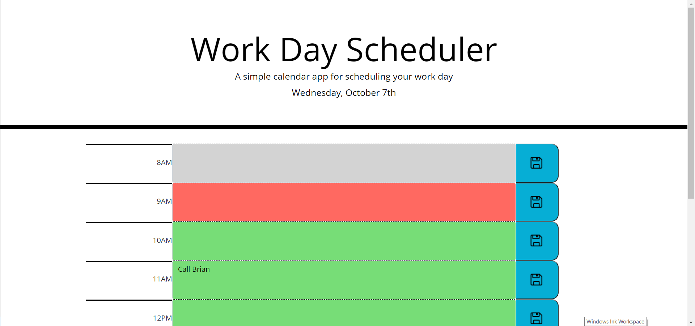

# Work-Day-scheduler

## Description 

This project designed a simple current day scheduler that uses moment.js to get current date information and uses local storage to save inputted appointments/tasks for each time block. Additionally, the scheduler is color coded based on the past, present, or future time. 

This project utilized jQuery to dynamically create and manipulate elements based on data attributes. Client-side storage was implemented to store saved entries so that they persist after refreshing the page. 

Event delegation is also implemented to match the clicked save buttons with the data attribute that corresponds with the inputted text. Conditional statements are used to determine color coding, appropriate suffixes (PM/AM), and to check for existing local storage variables. 

## Table of Contents 

* [Installation](#installation)
* [Usage](#usage)
* [Credits](#credits)
* [License](#license)

## Installation

Here is the link to the webpage:

https://jgarcia60.github.io/work-day-scheduler 

To install the project files, you can clone the "work-day-scheduler" repository which contains the necessary JavaScript, html, and CSS files at https://github.com/jgarcia60/work-day-scheduler by clicking the green drop down "Code" and cloning the repo with an SSH key.  

## Usage 

You may use this code as your own scheduler, or as a tool to develop a more advanced calendar, or as a learning tool for dynamically creating and appending HTML elements, using local storage, and implementing event delegation and event-handling for dynamic event listeners.

This is what it looks like:

## Credits

All HTML, CSS, and JS files, edits, additions, and revisions were done by Jonathan Garcia (https://github.com/jgarcia60/code-quiz). 

## License

MIT License

Copyright (c) [2020] [Jonathan Garcia]

Permission is hereby granted, free of charge, to any person obtaining a copy
of this software and associated documentation files (the "Software"), to deal
in the Software without restriction, including without limitation the rights
to use, copy, modify, merge, publish, distribute, sublicense, and/or sell
copies of the Software, and to permit persons to whom the Software is
furnished to do so, subject to the following conditions:

The above copyright notice and this permission notice shall be included in all
copies or substantial portions of the Software.

THE SOFTWARE IS PROVIDED "AS IS", WITHOUT WARRANTY OF ANY KIND, EXPRESS OR
IMPLIED, INCLUDING BUT NOT LIMITED TO THE WARRANTIES OF MERCHANTABILITY,
FITNESS FOR A PARTICULAR PURPOSE AND NONINFRINGEMENT. IN NO EVENT SHALL THE
AUTHORS OR COPYRIGHT HOLDERS BE LIABLE FOR ANY CLAIM, DAMAGES OR OTHER
LIABILITY, WHETHER IN AN ACTION OF CONTRACT, TORT OR OTHERWISE, ARISING FROM,
OUT OF OR IN CONNECTION WITH THE SOFTWARE OR THE USE OR OTHER DEALINGS IN THE
SOFTWARE.

---